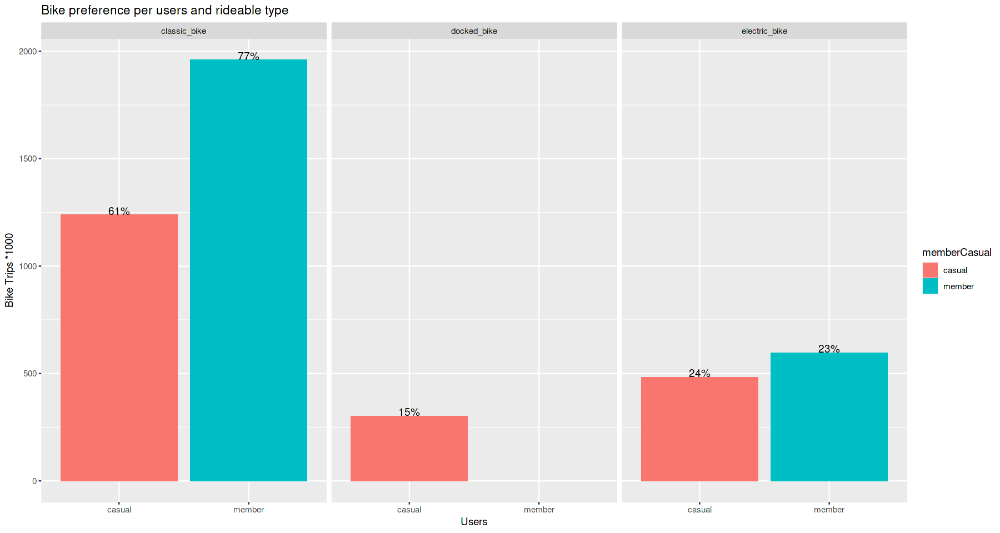

```{r setup, include=FALSE}
knitr::opts_chunk$set(echo = TRUE)
```

## How Does a Bike-Share Navigate Speedy Success?
### Google Analytics Capstone Project: Case stay 1. Cyclistic Bike-Share {.unlisted .unnumbered}

### 1. Business question: How do annual members and casual riders use Cyclistic bikes differently?


Image [W.Bulach](https://commons.wikimedia.org/wiki/User:W._Bulach)

#### Scenario {.unlisted .unnumbered}

You are a junior data analyst working in the marketing analyst team at Cyclistic, a bike-share company in Chicago. The director of marketing believes the company’s future success depends on maximizing the number of annual memberships. Therefore, your team wants to understand how casual riders and annual members use Cyclistic bikes differently. From these insights, your team will
design a new marketing strategy to convert casual riders into annual members. But first, Cyclistic executives must approve your recommendations, so they must be backed up with compelling data insights and professional data visualizations.

#### 2. About the company

In 2016, Cyclistic launched a successful bike-share offering. Since then, the program has grown to a fleet of 5,824 bicycles that are geotracked and locked into a network of 692 stations across Chicago. The bikes can be unlocked from one station and returned to any other station in the system anytime.

#### Tasks {.unlisted .unnumbered}
Produce a report with the following deliverables:
* 1. A clear statement of the business task
* 2. A description of all data sources used
* 3. Documentation of any cleaning or manipulation of data
* 4. A summary of your analysis
* 5. Supporting visualizations and key findings
* 6. Your top three recommendations based on your analysis

### 3. Business task: How do annual members and casual riders use Cyclistic bikes differently?
Analyse the data from the previous 12 months and find out how the different members use the bikes so we can target more casual members via a digital marketing strategy to become annual members.

##### Data: where has it come from and what time frame. {.unlisted .unnumbered}
The data is a set of .csv files provided by the company for each month from December 22 to November 23

#### Preparation for analysis. {.unlisted .unnumbered}

```{r}
library(tidyverse)
library(lubridate)
library(skimr)
library(dplyr)
library(tidyr)
library(DataExplorer)
library(scales)
library(forcats)
```


### 4. Importing and data validation.
Read in individual data sets.

```{r}
dec22 <- read_csv("./2023_bike_trips_working_directory/202212-divvy-tripdata.csv")
jan23 <- read_csv("./2023_bike_trips_working_directory/202301-divvy-tripdata.csv")
feb23 <- read_csv("./2023_bike_trips_working_directory/202302-divvy-tripdata.csv")
mar23 <- read_csv("./2023_bike_trips_working_directory/202303-divvy-tripdata.csv")
apr23 <- read_csv("./2023_bike_trips_working_directory/202304-divvy-tripdata.csv")
may23 <- read_csv("./2023_bike_trips_working_directory/202305-divvy-tripdata.csv")
jun23 <- read_csv("./2023_bike_trips_working_directory/202306-divvy-tripdata.csv")
jul23 <- read_csv("./2023_bike_trips_working_directory/202307-divvy-tripdata.csv")
aug23 <- read_csv("./2023_bike_trips_working_directory/202308-divvy-tripdata.csv")
sep23 <- read_csv("./2023_bike_trips_working_directory/202309-divvy-tripdata.csv")
oct23 <- read_csv("./2023_bike_trips_working_directory/202310-divvy-tripdata.csv")
nov23 <- read_csv("./2023_bike_trips_working_directory/202311-divvy-tripdata.csv")
```

Merge all data sets into 1 file.

```{r}
data <- rbind(dec22,jan23,feb23,mar23,apr23,may23,jun23,jul23,aug23,sep23,oct23,nov23)
```
```{r}
head(data)
```


### 5.Exploratory Data Analysis
Lets have a peak at our data.

```{r}
str(data)
```
```{r}
glimpse(data)
```

```{r}
skim_without_charts(data)
```


```{r}
introduce(data)
```
 We have 3597481 missing values
 Lets visualize the table above and conduct some light analysis
```{r}
plot_intro(data)
```
It seems we have some missing values, as stated in the table above.  
* 75.7% of the rows are complete. 
* 4.9% missing observations.

Lets take a closer look at the the missing data
```{r}
plot_missing(data)
```

Given that we have the most of the start and end latitudes we maybe able to fill these missing values with confidence. Lets find out.

### 6. Data Cleaning
Lets check how many unique station IDs we have compared to unique sets of starting or ending co-ordinates.
```{r}
# Count unique station ids
unique_station_ids <- data %>% 
  select(start_station_id, end_station_id) %>% 
  distinct() %>% 
  summarise(count = n())

# Count unique start_lat and start_long combinations
unique_start_lat_long <- data %>% 
  select(start_lat, start_lng) %>% 
  distinct() %>% 
  summarise(count = n())

# Count unique end_lat and end_long combinations
unique_end_lat_long <- data %>% 
  select(end_lat, end_lng) %>% 
  distinct() %>% 
  summarise(count = n())

unique_station_ids$count
unique_start_lat_long$count
unique_end_lat_long$count
```
By comparing the unique station IDs with the starting and ending lats and longs we can see that there must be some inconsistency in the data so we will not be able to match them.
So lets drop them from the table so we have clean data to work with.
```{r}
data_clean <- drop_na(data)
skim_without_charts(data_clean)
```

We had 5677610 rows of data before dropping th null values, now we have 4299967
We cleaned 1377643 rows of data which is about 25%
Lets check for duplicates.


Now we have clean data to work with lets do some data wrangling.

### 7. Data wrangling

We dont need the latitude and longditude columns as the data serves us no purpose so we can remove them.

```{r}
data_clean <- select(data_clean,-c(start_lat, start_lng, end_lat, end_lng))
head(data_clean)
```


The column names are unclear so lets rename them

```{r}
data_clean <- rename(data_clean, trip_id = ride_id,
                     bike_type = rideable_type, 
                     start_time = started_at,  
                     end_time = ended_at,
                     from_station_name = start_station_name, 
                     from_station_id = start_station_id, 
                     to_station_name = end_station_name, 
                     to_station_id = end_station_id, 
                     user_type = member_casual)
head(data_clean)
nrow(data_clean)
```
We can also remove any duplicated rows from the dataset based on the ride_id
```{r}
data_clean <- data_clean[!duplicated(data_clean$trip_id),] 
nrow(data_clean)
```
Seems like we got rid of all the bad fruit earlier.


Lets now add some columns for the days for the week and what year month and the hour of the day the ride started.

```{r}
data_clean <- data_clean %>%
  mutate(year = year(start_time),
         month = month(start_time, label = T),
         wday = wday(start_time, label= T),
         hour = format(as.POSIXct(start_time, format="%Y-%m-%d %H:%M"),format="%H"),
         duration_min = round(as.numeric(difftime(end_time,start_time,
                        units = "mins")),0)) %>%
select(-1)
head(data_clean)
```

Lets check the min and max ride times to see if we have more odd numbers.

```{r}
max(data_clean$duration_min)
min(data_clean$duration_min)
```

We better check for outliers 
```{r}
boxplot(data_clean$duration_min, horizontal = TRUE)
```
It seems we have more bad data, there is only 1440 minutes in a day so a rental for 12136 or 8.5 days seems a bit odd, but it could be a user who didn't return the bike or used it for multiple days.
Here some information on pricing would be helpful to learn what policies they have.
We also have a negative number of -55 and we cant be sure about if that was inputted incorrectly or a system error so we will remove it and then move on. 
Given that the business task is to get more causal users to become members we can also take a look at that.
```{r}
data_clean <- subset(data_clean, duration_min > 0)
min(data_clean$duration_min)
```

1 minute bike rides are not acceptable either, they must have been checking the bike so lets use data where the ride was 1 min or greater but from 1 station to another
```{r}
data_clean <- subset(data_clean,!(from_station_name == to_station_name & duration_min <= 1))
data_clean <- subset(data_clean,duration_min >= 1)
min(data_clean$duration_min)
```


Lets add some more columns so we can see the peak usage times

```{r}
data_clean$starting_time <- as.numeric(format(data_clean$start_time, "%H.%M"))


data_clean <- data_clean %>% mutate(rush_hour = case_when(starting_time >= 6.0 & starting_time <= 08.59 ~ "Morning rush",
                                                          starting_time >= 9.0 & starting_time <= 11.59 ~ "Late morning",
                                                          starting_time >= 12 & starting_time <= 15.59 ~ "Afternoon",
                                                          starting_time >= 16.0 & starting_time <= 18.59 ~ "Evening rush",
                                                          starting_time >= 19.0 & starting_time <= 23.59 ~ "Night" , 
                                                          starting_time >= 0.0 & starting_time <= 5.59  ~ "Midnight hours"))

data_clean <- select(data_clean,-starting_time)

head(data_clean)
```
Now we have clean data and some extra columns to work with so we can start the analysis

### 8. Analysis

Lets Calculate the average ride_length for members and casual riders.

```{r}
data_clean %>% 
  group_by(user_type) %>% 
  summarise_at(vars(duration_min), list(average_ride_time = mean))
```


Calculate the average ride_time for users by day_of_week. 
```{r}
data_clean%>%
group_by(user_type, wday) %>%
summarise(n = n(), duration=mean(duration_min))%>%
mutate(percentage = round(n/sum(n) *100))
```
Ride count by user, month
```{r}
month <- data_clean %>% 
    group_by(user_type, month) %>% 
    summarise(numberofrides = n(),.groups = "drop")

month
```


lets check the user types and see the customer base
```{r}
data_clean %>% 
  count(user_type) %>% 
  mutate(percent = n/nrow(data_clean),
         "%" = paste0(round(percent * 100)))
```
Lets see how the rides break down by bike type
```{r}
data_clean %>% 
  count(bike_type) %>% 
  mutate(percent = n/nrow(data_clean),
         "%" = paste0(round(percent*100)))
```
Lets check our the duration usage of each bike type
```{r}
data_clean %>% 
  group_by(bike_type) %>% 
  summarise(total=n()) %>% #
  mutate(total_hours = round(total/60),
         days = round(total_hours/24))
```


Lets get the top 10 pickup points for each day of the week. 

```{r}
data_clean %>% 
  group_by(user_type, wday,from_station_name) %>% 
  summarise(total=n(),duration=mean(duration_min)) %>% 
  arrange(desc(total))%>%
  slice_head(n=10)
```

```{r}
# Rides by user, hour
hour <- data_clean %>%
    group_by(user_type, hour) %>% 
    summarise(numberofrides = n(),.groups = 'drop') %>% 
      arrange(hour)

hour
```
number of rides by user and period of the day
```{r}
rushhour <- data_clean %>%
    group_by(user_type, rush_hour) %>% 
    summarise(numberofrides = n(),.groups = 'drop')  %>% 
      arrange(rush_hour)
rushhour
```
lets have a look at the users and the longer rides or multi day hires
```{r}
long_hire <- data_clean %>% 
  group_by(user_type) %>% 
  mutate(longhire = case_when(duration_min >= 1 & duration_min <= 20 ~ "0 - 20 min",
                               duration_min >= 21 & duration_min <= 60 ~ "20-60 min",
                               duration_min >= 61 & duration_min <= 120 ~ "1-2 hrs",
                               duration_min >= 121 & duration_min <= 240 ~ "2-4 hrs",
                               duration_min >= 241 & duration_min <= 480 ~ "4-8 hrs" , 
                               duration_min >= 481 & duration_min <= 1440 ~ "8-24hrs",
                               duration_min >= 1441 & duration_min <= 2880 ~ "1-2 days",
                               duration_min >= 2881 & duration_min <= 5760 ~ "2-4 days",
                               duration_min >= 5760 ~ "5 days or more")) %>% 
  group_by( longhire, user_type, wday) %>% 
  summarise(numberofrides = n(),.groups = 'drop') %>% 
  mutate(longhire = factor(longhire, levels = c("0 - 20 min", "20-60 min", "1-2 hrs", "2-4 hrs", "4-8 hrs", "8-24hrs", "1-2 days", "2-4 days", "5 days or more")))

long_hire

```


Lets clean up the results and find out the percentages for the causal users
```{r}

library(forcats)

long_hire1 <- data_clean_casual %>% 
  group_by(user_type) %>% 
  mutate(longhire = cut(duration_min, 
                        breaks = c(0, 20, 60, 120, 240, 480, 1440, 2880, 5760, Inf), 
                        labels = c("0 - 20 min", "20-60 min", "1-2 hrs", "2-4 hrs", "4-8 hrs", "8-24hrs", "1-2 days", "2-4 days", "5 days or more"))) %>% 
  group_by(longhire, user_type) %>% 
  summarise(numberofrides = n(), .groups = 'drop') %>% 
  mutate(longhire = fct_relevel(factor(longhire), "0 - 20 min", "20-60 min", "1-2 hrs", "2-4 hrs", "4-8 hrs", "8-24hrs", "1-2 days", "2-4 days", "5 days or more"), 
         total_rides = sum(numberofrides),
         percentage = round(numberofrides / total_rides * 100, 2))

long_hire1

```

```{r}
library(ggrepel)

ggplot(long_hire1, aes(x = "", y = numberofrides, fill = longhire)) +
  geom_bar(stat = "identity", width = 1) +
  coord_polar("y", start = 0) +
  labs(title = "Proportion of Rides by Time",
       x = NULL,
       y = NULL,
       fill = "Long Hire Category") +
  theme_minimal() +
  scale_fill_manual(values = c("#b3e6e9","#91d8e0", "#6fc9d3", "#4dbac6", "#2aaeb9", "#009faa", "#008c97" , "#007a87", "#006d77" )) +
  geom_text_repel(aes(label=numberofrides), box.padding=0.5, point.padding=0.5) +
   theme(plot.title = element_text(size = 22, color = "#42a0ab", face = "bold"), 
    plot.subtitle = element_text(size = 14, color = "grey20", face = "bold"), 
    plot.caption = element_text(size = 8, color = "grey35"),
    legend.title = element_text(size = 16, face = "bold", color = "#42a0ab"),
    legend.text = element_text(size = 14, color = "grey20"),
    axis.title.x = element_text(size = 15, color = "#42a0ab", face = "bold"), 
    axis.title.y = element_text(size = 15, color = "#42a0ab", face = "bold"),
    axis.text.x = element_text(size = 10, color = "grey20", face = "bold"),
    axis.text.y = element_text(size = 10, color = "grey20", face = "bold"))
```


### 9. Visual Analysis
Lets plot the different user types
```{r}
data_clean %>% 
  count(user_type) %>% 
  mutate(percent = n/nrow(data_clean),
         percent_label = paste0(round(percent * 100), "%")) %>%
  ggplot(aes("", percent, fill = user_type, label = percent_label)) +
  geom_col(color = "white") +
  geom_text(color = "black",
            position = position_stack(vjust = 0.5),
            size = 7) +
  coord_polar(theta = "y", start = 0) +
  theme_void() +
  guides(fill = guide_legend(reverse = TRUE)) +
  scale_fill_manual(values = c("#91d8e0","#42a0ab")) +
  labs(fill = "User Type" ,
       title = "Percentage of User Type") +
  theme(plot.title = element_text(size = 22, color = "#42a0ab", face = "bold"), 
    plot.subtitle = element_text(size = 14, color = "grey20", face = "bold"), 
    plot.caption = element_text(size = 8, color = "grey35"),
    legend.title = element_text(size = 16, face = "bold", color = "#42a0ab"),
    legend.text = element_text(size = 14, color = "grey20"),
    axis.title.x = element_text(size = 15, color = "#42a0ab", face = "bold"), 
    axis.title.y = element_text(size = 15, color = "#42a0ab", face = "bold"),
    axis.text.x = element_text(size = 10, color = "grey20", face = "bold"),
    axis.text.y = element_text(size = 10, color = "grey20", face = "bold"))
```
Lets now have a look at what type of bikes each user type used.
```{r}
ggplot(
     data_clean%>%
    group_by(user_type, bike_type) %>%
    summarise(n = n())%>%
    mutate(percentage = n/sum(n) *100) ,
    aes(x=user_type, y=n/1000, fill=user_type)
) + 
geom_col(position="dodge") +
scale_fill_manual(values = c("#91d8e0","#42a0ab")) +
geom_text(aes(label = paste0(round(percentage), "%")), position=position_dodge(0.85), vjust = 0) +
labs(x="Users", y="Bike Trips *1000", title="Bike preference per users and rideable type")+
  theme(plot.title = element_text(size = 22, color = "#42a0ab", face = "bold"), 
    plot.subtitle = element_text(size = 14, color = "grey20", face = "bold"), 
    plot.caption = element_text(size = 8, color = "grey35"),
    legend.title = element_text(size = 16, face = "bold", color = "#42a0ab"),
    legend.text = element_text(size = 14, color = "grey20"),
    axis.title.x = element_text(size = 15, color = "#42a0ab", face = "bold"), 
    axis.title.y = element_text(size = 15, color = "#42a0ab", face = "bold"),
    axis.text.x = element_text(size = 10, color = "grey20", face = "bold"),
    axis.text.y = element_text(size = 10, color = "grey20", face = "bold"))+
facet_wrap(~bike_type)
```
We can see that the 'docked_bike' usage is only for casual members and if we compare this to previos years data we can see a big increase in electric bike usage.
In a previous 2021-2022 analysis electric bike usage was at 24% and 25% respectively 

{out.dim= c(25%)}  
source [PEYMAN MIHANKHAH](https://www.kaggle.com/code/peymanmi/cyclistic-casestudy-r)

Lets look at when the most rides occur.

```{r}
ggplot(hour, aes(hour, numberofrides,  fill = user_type, group = user_type)) +
geom_bar(stat = "identity") +
scale_fill_manual(values = c("#91d8e0", "#42a0ab"), name = "Types of riders", breaks = c("casual", "member"), labels = c("Casual Member", "Annual Member")) +
labs(title = "Rides Throughout the Day", subtitle = "Rides peak during early evening hours",
    caption = "Data: Motivate International",
    x = "Hour", y = "Number of Rides") +
theme_minimal() +
theme(plot.title = element_text(size = 22, color = "#42a0ab", face = "bold"), 
    plot.subtitle = element_text(size = 14, color = "grey20", face = "bold"), 
    plot.caption = element_text(size = 8, color = "grey35"),
    legend.title = element_text(size = 16, face = "bold", color = "#42a0ab"),
    legend.text = element_text(size = 14, color = "grey20"),
    axis.title.x = element_text(size = 15, color = "#42a0ab", face = "bold"), 
    axis.title.y = element_text(size = 15, color = "#42a0ab", face = "bold"),
    axis.text.x = element_text(size = 10, color = "grey20", face = "bold"),
    axis.text.y = element_text(size = 10, color = "grey20", face = "bold"))
```
Lets break this down further into peak times such as morning and evening traditional work times. 

```{r}
rushhour %>% ggplot(mapping = aes(x=rush_hour, y= numberofrides, fill = user_type)) + 
  geom_col(position="dodge") +
  scale_x_discrete(limits = c("Morning rush", "Late morning", "Afternoon", "Evening rush", "Night", "Midnight hours")) +
  scale_y_continuous(labels = comma) +
  scale_fill_manual(values = c("#91d8e0", "#42a0ab")) +
  ggtitle("Number of rides taken by each user type") +
  xlab("Rush Hour") +
  ylab("Number Of  Rides") +
  labs(fill = "User Type")+
  theme_classic()+
  theme(plot.title = element_text(size = 22, color = "#42a0ab", face = "bold"), 
    plot.subtitle = element_text(size = 14, color = "grey20", face = "bold"), 
    plot.caption = element_text(size = 8, color = "grey35"),
    legend.title = element_text(size = 16, face = "bold", color = "#42a0ab"),
    legend.text = element_text(size = 14, color = "grey20"),
    axis.title.x = element_text(size = 15, color = "#42a0ab", face = "bold"), 
    axis.title.y = element_text(size = 15, color = "#42a0ab", face = "bold"),
    axis.text.x = element_text(size = 10, color = "grey20", face = "bold"),
    axis.text.y = element_text(size = 10, color = "grey20", face = "bold"))
```
Lets have a closer look at the multi-day hires.
Lets drop the rides of an hour or less because they make up the vast majority.

```{r}
long_hire_filtered <- long_hire %>% 
  filter(longhire != "0 - 20 min" & longhire != "20-60 min")
```


```{r}
grouped_hire_duration_plot <- ggplot(long_hire_filtered, aes(x = user_type, y = numberofrides, fill = longhire)) +
  geom_bar(stat = "identity", position = "dodge") +
  labs(title = "Rental length by user type",
       x = "User Type",
       y = "Number of Rides",
       fill = "Rental time") +
  theme_minimal() +
  scale_fill_manual(values = c("#b3e6e9","#91d8e0", "#6fc9d3", "#4dbac6", "#2aaeb9", "#009faa", "#008c97"  )) +
  scale_y_log10() +
  geom_text(aes(label = numberofrides), position = position_dodge(width = 0.9), vjust = -0.5)+
  theme(plot.title = element_text(size = 22, color = "#42a0ab", face = "bold"), 
    plot.subtitle = element_text(size = 14, color = "grey20", face = "bold"), 
    plot.caption = element_text(size = 8, color = "grey35"),
    legend.title = element_text(size = 16, face = "bold", color = "#42a0ab"),
    legend.text = element_text(size = 14, color = "grey20"),
    axis.title.x = element_text(size = 15, color = "#42a0ab", face = "bold"), 
    axis.title.y = element_text(size = 15, color = "#42a0ab", face = "bold"),
    axis.text.x = element_text(size = 10, color = "grey20", face = "bold"),
    axis.text.y = element_text(size = 10, color = "grey20", face = "bold"))
```
```{r}
grouped_hire_duration_plot
```

```{r}
casual_filtered <- long_hire_filtered %>%  filter(user_type != 'member')

ggplot(casual_filtered, aes(x = user_type, y = numberofrides, fill = longhire)) +
  geom_bar(stat = "identity", position = "dodge") +
  labs(title = "Rental length by user type",
       x = "User Type",
       y = "Number of Rides",
       fill = "Rental time") +
  theme_minimal() +
  scale_fill_manual(values = c("#b3e6e9","#91d8e0", "#6fc9d3", "#4dbac6", "#2aaeb9", "#009faa", "#008c97"  )) +
  scale_y_log10() +
  geom_text(aes(label = numberofrides), position = position_dodge(width = 0.9), vjust = -0.5)+
  theme(plot.title = element_text(size = 22, color = "#42a0ab", face = "bold"), 
    plot.subtitle = element_text(size = 14, color = "grey20", face = "bold"), 
    plot.caption = element_text(size = 8, color = "grey35"),
    legend.title = element_text(size = 16, face = "bold", color = "#42a0ab"),
    legend.text = element_text(size = 14, color = "grey20"),
    axis.title.x = element_text(size = 15, color = "#42a0ab", face = "bold"), 
    axis.title.y = element_text(size = 15, color = "#42a0ab", face = "bold"),
    axis.text.x = element_text(size = 10, color = "grey20", face = "bold"),
    axis.text.y = element_text(size = 10, color = "grey20", face = "bold"))
```


Now lets focus in on the rides that lasted longer than a day.

```{r}
long_hire_filtered1 <- long_hire %>% 
  filter(longhire %in% c("1-2 days", "2-4 days", "5 days or more"))

day_or_longer_plot <- ggplot(long_hire_filtered1, aes(x = user_type, y = numberofrides, fill = longhire)) +
  geom_bar(stat = "identity", position = "dodge") +
  labs(title = "Long hire bike rental by user type",
       x = "User Type",
       y = "Number of Rides",
       fill = "Long Hire") +
  theme_minimal() +
  scale_fill_manual(values = c("#b3e6e9","#91d8e0", "#42a0ab")) +
  theme(plot.title = element_text(size = 22, color = "#42a0ab", face = "bold"), 
    plot.subtitle = element_text(size = 14, color = "grey20", face = "bold"), 
    plot.caption = element_text(size = 8, color = "grey35"),
    legend.title = element_text(size = 16, face = "bold", color = "#42a0ab"),
    legend.text = element_text(size = 14, color = "grey20"),
    axis.title.x = element_text(size = 15, color = "#42a0ab", face = "bold"), 
    axis.title.y = element_text(size = 15, color = "#42a0ab", face = "bold"),
    axis.text.x = element_text(size = 10, color = "grey20", face = "bold"),
    axis.text.y = element_text(size = 10, color = "grey20", face = "bold")) 
  #geom_text(aes(label = numberofrides), position = position_dodge(width = 0.9), vjust = -0.5)
```


```{r}
day_or_longer_plot
```
From and initial 4299967 ride we can see a total of 131 rides that went for more than a day. This number is insignificant in the scheme of thing and could be from user error when closing out the ride or from errors in the docking station so no further investigation is warranted.

lets see if the day of the week matters

```{r}
ggplot(data_clean, aes(x = wday, fill = user_type)) +
  geom_bar(position = "dodge") +
  labs(title = "Trips by user type on each day of the week",
       x = "Day of the week",
       y = "Number of trips",
       fill = "User type") +
  theme_minimal() +
    scale_fill_manual(values = c("#91d8e0", "#42a0ab")) +
  theme(plot.title = element_text(size = 22, color = "#42a0ab", face = "bold"), 
    plot.subtitle = element_text(size = 14, color = "grey20", face = "bold"), 
    plot.caption = element_text(size = 8, color = "grey35"),
    legend.title = element_text(size = 16, face = "bold", color = "#42a0ab"),
    legend.text = element_text(size = 14, color = "grey20"),
    axis.title.x = element_text(size = 15, color = "#42a0ab", face = "bold"), 
    axis.title.y = element_text(size = 15, color = "#42a0ab", face = "bold"),
    axis.text.x = element_text(size = 10, color = "grey20", face = "bold"),
    axis.text.y = element_text(size = 10, color = "grey20", face = "bold")) 
```
Here we see that Members use the bikes more during the standard working week, and we can see that there is an increase in casual users in the weekend. We can see consistent usage by casual users during the week with an increase towards and during the weekend


Lets have a look at our commuters who use the bikes for less than an hour each day.

```{r}
short_hire_filtered <- long_hire %>% 
  filter(longhire == "0 - 20 min" | longhire == "20-60 min")

ggplot(short_hire_filtered, aes(x = wday, y = numberofrides, fill = longhire)) +
  geom_bar(stat = "identity", position = "dodge") +
  labs(title = "Short rental length by user type",
       x = "Week day",
       y = "Number of Rides",
       fill = "Rental time") +
  theme_minimal() +
  scale_fill_manual(values = c("#91d8e0", "#2aaeb9"  )) +
    theme(plot.title = element_text(size = 22, color = "#42a0ab", face = "bold"), 
    plot.subtitle = element_text(size = 14, color = "grey20", face = "bold"), 
    plot.caption = element_text(size = 8, color = "grey35"),
    legend.title = element_text(size = 16, face = "bold", color = "#42a0ab"),
    legend.text = element_text(size = 14, color = "grey20"),
    axis.title.x = element_text(size = 15, color = "#42a0ab", face = "bold"), 
    axis.title.y = element_text(size = 15, color = "#42a0ab", face = "bold"),
    axis.text.x = element_text(size = 10, color = "grey20", face = "bold"),
    axis.text.y = element_text(size = 10, color = "grey20", face = "bold"))+
  facet_wrap(~user_type)
```
We  can see that more members use the bikes for short commutes during the weekdays, where as more causal users use the bikes for short trips in the weekend.

Lets have a deeper look at the causal users and how the rises stack up on each day of the week.

```{r}
long_hire_wday <- data_clean_casual %>% 
  group_by(user_type, wday) %>% 
  mutate(longhire = cut(duration_min, 
                        breaks = c(0, 20, 60, 120, 240, 480, 1440, 2880, 5760, Inf), 
                        labels = c("0 - 20 min", "20-60 min", "1-2 hrs", "2-4 hrs", "4-8 hrs", "8-24hrs", "1-2 days", "2-4 days", "5 days or more"))) %>% 
  group_by(longhire, user_type, wday) %>% 
  summarise(numberofrides = n(), .groups = 'drop') %>% 
  mutate(longhire = fct_relevel(factor(longhire), "0 - 20 min", "20-60 min", "1-2 hrs", "2-4 hrs", "4-8 hrs", "8-24hrs", "1-2 days", "2-4 days", "5 days or more"), 
         total_rides = sum(numberofrides),
         percentage = round(numberofrides / total_rides * 100, 2))


# Create a stacked bar chart with the percentage of longhire time for each day
ggplot(long_hire_wday, aes(x = wday, y = percentage, fill = longhire)) +
  geom_bar(stat = "identity", position = "fill") +
  labs(title = "Percentage of Long Hire Time by Day for User Type Casual",
       x = "Day of the Week",
       y = "Percentage of Hire Time",
       fill = "Hire Time") +
  theme_minimal() +
  scale_fill_manual(values = c("#b3e6e9","#91d8e0", "#6fc9d3", "#4dbac6", "#2aaeb9", "#009faa", "#008c97" , "#007a87", "#006d77"    )) +
  theme(plot.title = element_text(size = 22, color = "#42a0ab", face = "bold"), 
    plot.subtitle = element_text(size = 14, color = "grey20", face = "bold"), 
    plot.caption = element_text(size = 8, color = "grey35"),
    legend.title = element_text(size = 16, face = "bold", color = "#42a0ab"),
    legend.text = element_text(size = 14, color = "grey20"),
    axis.title.x = element_text(size = 15, color = "#42a0ab", face = "bold"), 
    axis.title.y = element_text(size = 15, color = "#42a0ab", face = "bold"),
    axis.text.x = element_text(size = 10, color = "grey20", face = "bold"),
    axis.text.y = element_text(size = 10, color = "grey20", face = "bold"))


```
Here we can see that as a percentage, the is a higher use for short 0-20 min trips by casual users during weekdays. Although there are more causal users in the weekend, the week day users seem to mimic those of members.

```{r}
library(ggplot2)

# Filter rows where percentage is greater than 2
long_hire1_filtered <- long_hire1 %>% filter(percentage > 2)

# Create pie chart with filtered data
ggplot(long_hire1_filtered, aes(x = "", y = numberofrides, fill = longhire)) +
  geom_bar(stat = "identity", width = 1) +
  coord_polar(theta = "y", start = 0 ) +
  geom_text(aes(label = ifelse(percentage > 2, paste0(round(percentage, 2), "%"), "")), 
            position = position_stack(vjust = 0.5)) +
  labs(title = "Proportion of Rides by Hire Time",
       x = NULL,
       y = NULL,
       fill = "Hire Period") +
  theme_minimal() +
  scale_fill_manual(values = c("#b3e6e9","#6fc9d3", "#009faa",  "#006d77" )) +
    theme(plot.title = element_text(size = 22, color = "#42a0ab", face = "bold"), 
    plot.subtitle = element_text(size = 14, color = "grey20", face = "bold"), 
    plot.caption = element_text(size = 8, color = "grey35"),
    legend.title = element_text(size = 16, face = "bold", color = "#42a0ab"),
    legend.text = element_text(size = 14, color = "grey20"))

```
Here we confirm that almost 70% of all casual users are using the bikes for short commutes.


### 10. Conclusion 


